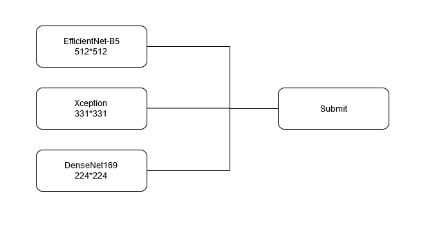

# Flower Classification on TPU
My solution:
  

Here the competition was to correctly classify 104 types of flowers using TPU. This competion had no money prices, but had very good notebooks from kaggle community from which i learned many things and used in the solution. The input images in this competition were of multiple sizes(192, 224, 331, 512) so i trained different models with different image sizes, according to thier parameters size(as larger model benefits from bigger image size) but the dataset was imbalanced across the number of classes of flowers. There was a extra-dataset of flowers introduced by kaggle member which had very good amount of data. Although applying alone data-augumenting provided fine results. But using both extra data and data-augumentations provided better resutls. 

1. EffNet B5:
  - The resutls of this model were enough from 10 epochs only(lb 0.96407), but i still went ahead trained more and also trained rest 2 to form a ensemble.
  - Augumentations: Cutmix+Mixup, Rotation Auguments + Some Tf-image transformations, Train on fulldataset No validationset.
  - 30 epochs, Batch_size 256, Image-size 512.
  - Results: For 10 Epochs, categorical_accuracy: 0.8287, loss: 0.9035. 30 Epochs, categorical_accuracy: 0.8463 - loss: 0.7993 lb=0.96576
  
2. Xception:
  - Augumentations: Cutmix+Mixup, Rotation Auguments + Some Tf-image transformations, Train on fulldataset No validationset.
  - 30 epochs, Batch_size 256, Image-size 331.
  - Results: For 30 Epochs, loss: 0.8208 - categorical_accuracy: 0.8685.
  
3. Densenet169:  
  - Augumentations: Cutmix+Mixup, Rotation Auguments + Some Tf-image transformations, Train on fulldataset No validationset.
  - 30 epochs, Batch_size 256, Image-size 224.
  - Results: For 30 Epochs, loss: 0.8723 - categorical_accuracy: 0.8633. lb=0.96441
  
4. Ensemble gave lb=0.96708  
