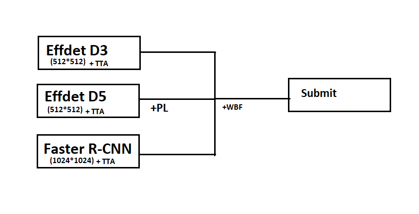

# Wheat Detection Kaggle
My solution:
  

1. Effdet D3:
  - First 25 epochs with AdamW(lr=0.001), image size=512, Augs+cutmix, 5 folds dataset, step_lr : val_loss=0.4149, lb=.6771.
  - Then with SGDP(lr=0.001), (20)25-45 epochs, Cosine learning rate : val_loss=0.3673, lb=0.7108.
  - More ~50 epochs SGDP (21)44-60 epochs, lr=0.0001, Cosine learning rate(restore lr_sh, op), best_w=69 eps : val_loss=0.3661 ,lb=.7105.
  
2. Effdet D5:
  - Heavy Augs with mixed_precision training(to improve training speed) and gradient accumulation(to use bigger batch size)added: lb=.7145.
  - Training was same as Effdet D3, Pseudo Labelling(3 epoch). lb=.7274.
  
3. Faster R-CNN(with resnet12 backbone):  
  - Heavy Augs, image_size=1024, 5 folds, AdamW(lr=0.001) step_lr for 30 epochs: lb=.6945.
  - Then plain SGD with CosineAnnealingLR schedule for ~50 epochs: lb=.7185.
  - Lastly made the ensemble for 2 effdetd5(1PL another no PL) + 1 Effdetd3 + frcnn, which gave around lb=~.73 and private score=~.67.
  
  
  
